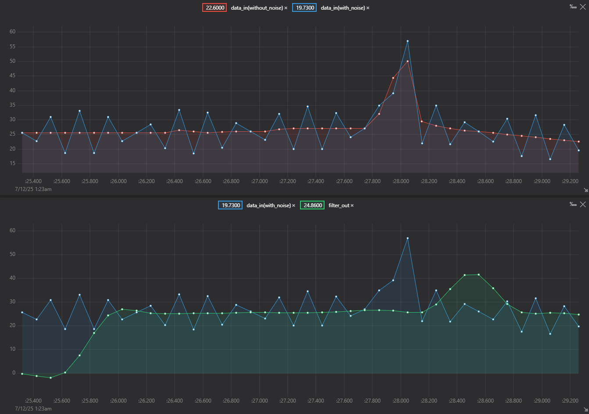
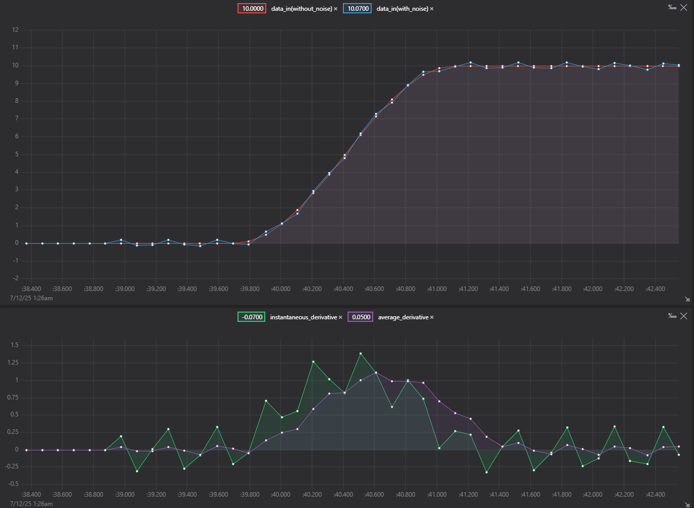
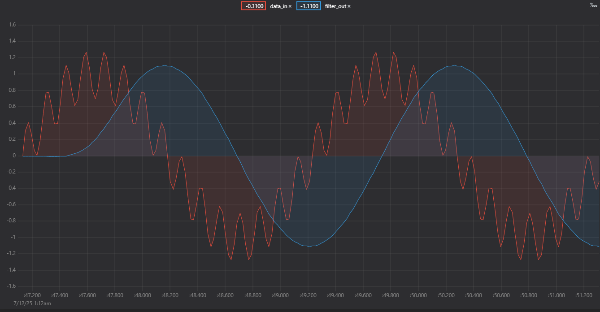
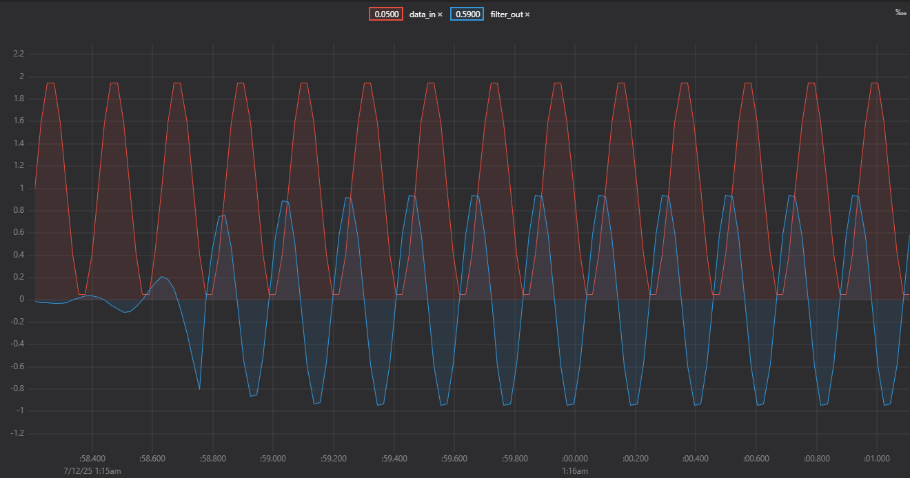
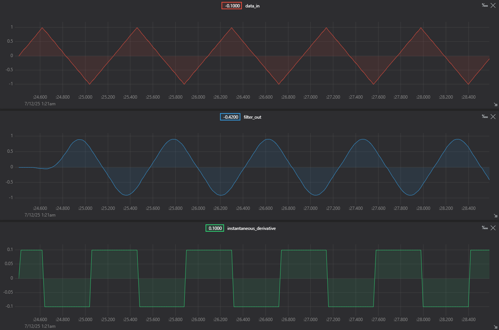

# FIR\_Filters

 

A lightweight and flexible FIR (Finite Impulse Response) filter library for microcontrollers, with support for signal filtering and derivative calculation (instantaneous and average). Designed for real-time data acquisition applications such as sensor smoothing and signal analysis.

---

## 📦 Features

* Circular FIR filtering with customizable coefficients
* Automatic time unit conversion (seconds, milliseconds, microseconds)
* Instantaneous derivative calculation using timestamps
* Average derivative calculation
* Compatible with both `float` and `double` types
* Ready-to-use on Arduino and PlatformIO

---

## 📚 Usage

See examples in the repository folder or run on microcontroller

## 🥪 Examples

### 1. How to use the filter

See: [`examples/how_to_use.ino`](examples/how_to_use.ino)
Basic demonstration of filter configuration and usage.

---

### 2. Filtering sensor data

See: [`examples/filter_data_from_sensor.ino`](examples/filter_data_from_sensor.ino)
Use case where noisy temperature data is filtered using a low-pass FIR filter.

---

### 3. Vertical speed calculation (VSI)

See: [`examples/calculate_vertical_speed.ino`](examples/calculate_vertical_speed.ino)
Computes the derivative of aircraft altitude using filtered or raw data.

### VSI Calculation

---

### 4. FIR on signals

See: [`examples/signals_example_with_post_multiplication.ino`](examples/signals_example_with_post_multiplication.ino)
Demonstrates how the filter reacts to sine/triangle waves and how the output changes depending on the coefficients.

---

### Filtering two overlapping sine waves with different frequencies

---

### Remove DC offset with High Pass Filter

---

### Low Pass Filter on Triangular Wave

